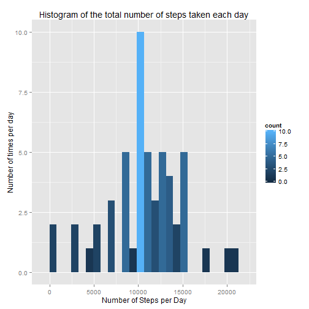
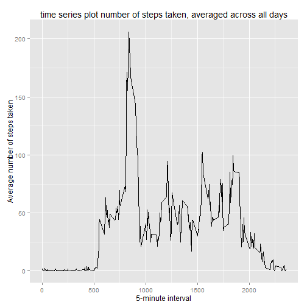
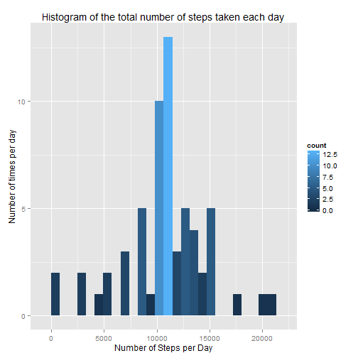
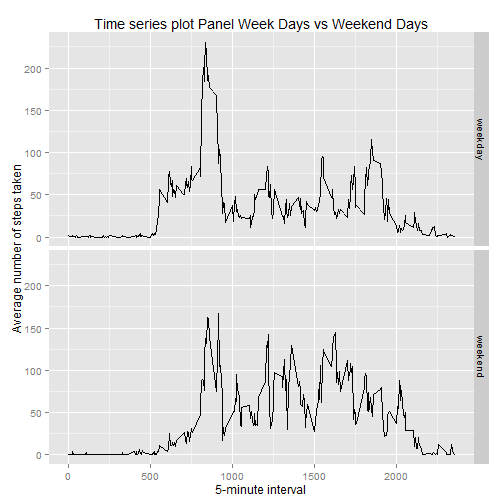

  
### Initialization

Loading required libraries

```r
library(ggplot2)
library(data.table)
library(knitr)
```


Settings

```r
options(scipen=1, digits=2)
opts_chunk$set(echo = TRUE)
```

### Loading and preprocessing the data
#### 1.Load the data (i.e. > read.csv())

```r
unzip("activity.zip", overwrite =  FALSE)
df <- read.csv("activity.csv", header =   TRUE, sep = ',', colClasses=c("numeric", "character", "numeric"))
# summary of the loaded dataframe
str(df)
```

```
## 'data.frame':	17568 obs. of  3 variables:
##  $ steps   : num  NA NA NA NA NA NA NA NA NA NA ...
##  $ date    : chr  "2012-10-01" "2012-10-01" "2012-10-01" "2012-10-01" ...
##  $ interval: num  0 5 10 15 20 25 30 35 40 45 ...
```

#### 2.Process/transform the data (if necessary) into a format suitable for your analysis

```r
df$date <- as.Date(df$date, format = "%Y-%m-%d")
head(df,3)
```

```
##   steps       date interval
## 1    NA 2012-10-01        0
## 2    NA 2012-10-01        5
## 3    NA 2012-10-01       10
```

```r
str(df)
```

```
## 'data.frame':	17568 obs. of  3 variables:
##  $ steps   : num  NA NA NA NA NA NA NA NA NA NA ...
##  $ date    : Date, format: "2012-10-01" "2012-10-01" ...
##  $ interval: num  0 5 10 15 20 25 30 35 40 45 ...
```

### What is mean total number of steps taken per day?
#### 1.Calculate the total number of steps taken per day

```r
Total_Steps_per_day <- aggregate(steps ~ date, df, sum)
head(Total_Steps_per_day, 3)
```

```
##         date steps
## 1 2012-10-02   126
## 2 2012-10-03 11352
## 3 2012-10-04 12116
```

#### 2.Make a histogram of the total number of steps taken each day


```r
ggplot(data=Total_Steps_per_day, aes(x = steps)) + 
  geom_histogram(binwidth = 820, aes( fill=..count..)) + 
        labs(title="Histogram of the total number of steps taken each day", 
             x = "Number of Steps per Day", y = "Number of times per day") 
```

 


#### 3.Calculate and report the mean and median of the total number of steps taken per day
We ignore the missing values

```r
mean_Steps_per_day   <- mean(Total_Steps_per_day$steps, na.rm=TRUE)
median_Steps_per_day <- median(Total_Steps_per_day$steps, na.rm=TRUE)
```
the mean is 10766.19, the median is 10765


### What is the average daily activity pattern?

#### 1.Make a time series plot (i.e. type = "l") of the 5-minute interval (x-axis) and the average number of steps taken, averaged across all days (y-axis)

```r
steps_per_interval <- aggregate(x=list(mean_Steps=df$steps), by=list(interval=df$interval), FUN=mean, na.rm=TRUE)
ggplot(data=steps_per_interval, aes(x=interval, y=mean_Steps)) +
    geom_line() +
    xlab("5-minute interval") +
    ylab("Average number of steps taken") + 
    ggtitle("time series plot number of steps taken, averaged across all days")
```

 


#### 2.Which 5-minute interval, on average across all the days in the dataset, contains the maximum number of steps?

```r
max_interval <- steps_per_interval[which.max(steps_per_interval$mean_Steps),]
```
the interval 835 contains the maximum steps : 206.17 steps

### Imputing missing values
#### 1.Calculate and report the total number of missing values in the dataset (i.e. the total number of rows with NAs)

```r
missing_values <-length(which(is.na(df$steps)))
```

The number of missing values is : 2304 

#### 2.Devise a strategy for filling in all of the missing values in the dataset. The strategy does not need to be sophisticated. For example, you could use the mean/median for that day, or the mean for that 5-minute interval, etc.
We choose to replace missing values by the interval mean, previously computed 

#### 3.Create a new dataset that is equal to the original dataset but with the missing data filled in.

```r
new_df <- df 
for (i in 1:nrow(new_df)) {
    if (is.na(new_df$steps[i])) {
          new_df$steps[i] <- steps_per_interval[which(new_df$interval[i] == steps_per_interval$interval), ]$mean_Steps
    }
}
```
#### 4.Make a histogram of the total number of steps taken each day and Calculate and report the mean and median total number of steps taken per day. Do these values differ from the estimates from the first part of the assignment? What is the impact of imputing missing data on the estimates of the total daily number of steps?


```r
new_Total_Steps_per_day <- aggregate(steps ~ date, new_df, sum)

ggplot(data=new_Total_Steps_per_day, aes(x = steps)) + 
  geom_histogram(binwidth = 820, aes( fill=..count..)) + 
        labs(title="Histogram of the total number of steps taken each day", 
             x = "Number of Steps per Day", y = "Number of times per day") 
```

 

```r
new_mean_Steps_per_day   <- mean(new_Total_Steps_per_day$steps, na.rm=TRUE)
new_median_Steps_per_day <- median(new_Total_Steps_per_day$steps, na.rm=TRUE)
```
After  imputing, the new mean is 10766.19, the new median is 10766.19  
Before imputing, the old mean is 10766.19, the old median is 10765  
The mean did not change, whilst the median slightly increased

### Are there differences in activity patterns between weekdays and weekends?
#### 1.Create a new factor variable in the dataset with two levels - "weekday" and "weekend" indicating whether a given date is a weekday or weekend day.

```r
new_df$weekday_type <-  ifelse(as.POSIXlt(new_df$date)$wday %in% c(0,6), 'weekend', 'weekday')
```

#### 2.Make a panel plot containing a time series plot (i.e. type = "l") of the 5-minute interval (x-axis) and the average number of steps taken, averaged across all weekday days or weekend days (y-axis)

```r
new_steps_per_interval <- aggregate(steps ~ interval + weekday_type, data=new_df, mean)

ggplot(new_steps_per_interval, aes(interval, steps)) + 
    geom_line() + 
    facet_grid(weekday_type ~ .) +
    xlab("5-minute interval") + 
    ylab("Average number of steps taken") + 
    ggtitle("Time series plot Panel Week Days vs Weekend Days")
```

 
  
Week days activity is more important. Moreover, two peaks appear in around midday and afterwork periods.  
We notice that the weekend activity is more homogeneous.

